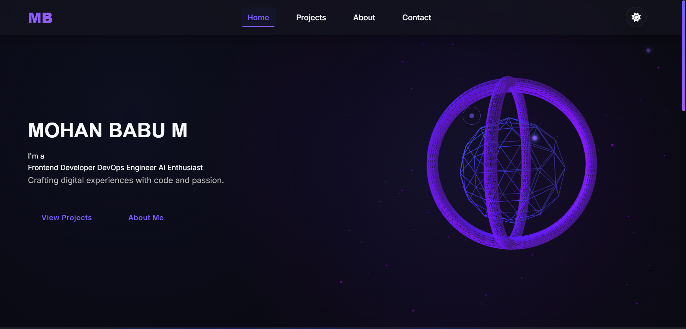
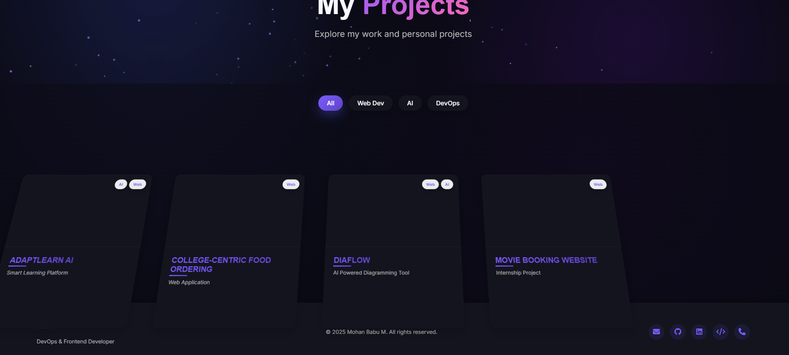
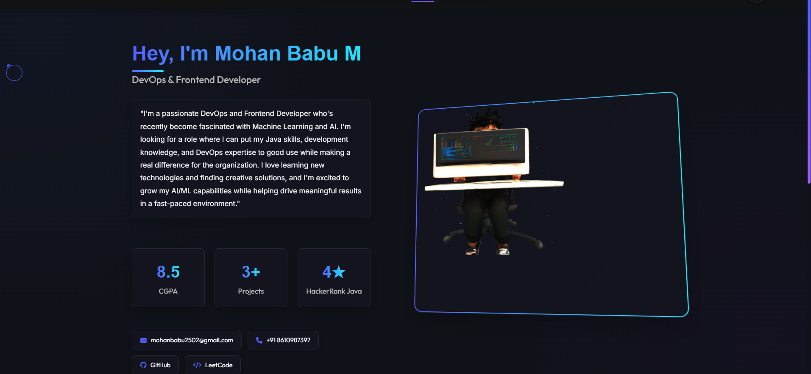
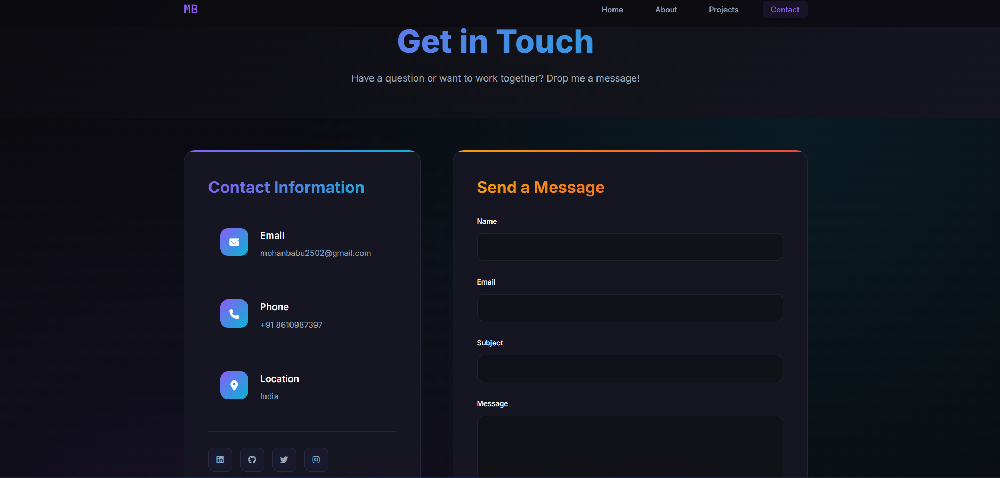

# 🚀 Mohan Babu M - Personal Portfolio

A modern, interactive portfolio website showcasing my skills as a DevOps & Frontend Developer with a passion for Machine Learning and AI.


## 🌟 Features

- **Responsive Design** - Seamlessly adapts to all device sizes
- **Interactive 3D Avatar** - Custom GLB model with mouse interactions
- **Modern Animations** - Smooth GSAP animations and scroll triggers
- **Dark/Light Theme** - Toggle between themes with persistent storage
- **Custom Cursor** - Enhanced user experience with animated cursor
- **Particle Effects** - Dynamic background animations
- **Skill Visualizations** - Animated progress bars and charts
- **Project Showcase** - Interactive project cards with live demos
- **Contact Integration** - Direct email and social media links

## 📸 Screenshots

### Home Page

*Landing page with hero section, animated background, and call-to-action*

### Projects Section  

*Showcase of featured projects with interactive cards and live demo links*

### About Me

*Personal information, skills visualization, experience timeline, and 3D avatar*

### Contact

*Contact form, social media links, and location information*

## 🛠️ Tech Stack

### Frontend
- **HTML5** - Semantic markup structure
- **CSS3** - Modern styling with CSS Grid and Flexbox
- **JavaScript (ES6+)** - Interactive functionality
- **GSAP** - Advanced animations and scroll triggers
- **Three.js** - 3D graphics and model rendering

### 3D Graphics
- **Three.js r128** - 3D scene management
- **GLTFLoader** - 3D model loading (.glb format)
- **WebGL** - Hardware-accelerated 3D rendering

### Tools & Libraries
- **Font Awesome** - Icon library
- **Google Fonts** - Typography
- **Intersection Observer API** - Performance optimization

## 🚀 Getting Started

### Prerequisites
- Modern web browser with WebGL support
- Local web server (for 3D model loading)

### Installation

1. **Clone the repository**
```bash
git clone https://github.com/mohan-ux/portfolio.git
cd portfolio
```

2. **Add your 3D model**
```bash
# Place your model.glb file in the project root
cp /path/to/your/model.glb ./model.glb
```

3. **Start a local server**
```bash
# Using Python 3
python -m http.server 3000

# Using Node.js (if you have live-server installed)
node Server.js

# Using VS Code Live Server extension
# Right-click on index.html and select "Open with Live Server"
```

4. **Open your browser**
```
http://localhost:3000
```

## 📁 Project Structure

```
portfolio/
├── index.html              # Home page
├── About.html              # About page  
├── projects.html           # Projects page
├── Contact.html            # Contact page
├── Styles.css              # Global styles
├── about.css               # About page specific styles
├── about.js                # About page functionality
├── model.glb               # 3D avatar model
├── assets/                 # Images and icons
│   ├── home.png
│   ├── projects.png  
│   ├── About.png
│   └── contact.png
└── README.md               # Project documentation
```

## 🎨 Customization

### Theme Colors
Update CSS custom properties in `Styles.css`:
```css
:root {
  --primary-color: #9966ff;
  --secondary-color: #00ffff;
  --accent-color: #ff6b6b;
  --bg-color: #0a0a0a;
}
```

### 3D Model Settings
Modify in `about.js`:
```javascript
// Scale your model
avatarModel.scale.set(2, 2, 2);

// Position adjustment  
avatarModel.position.set(0, -1, 0);

// Model file path
'./model.glb'
```

### Personal Information
Update content in HTML files:
- Contact details in `About.html`
- Project information in `projects.html`
- Skills and experience data

## 📱 Responsive Breakpoints

- **Mobile**: 320px - 768px
- **Tablet**: 768px - 1024px  
- **Desktop**: 1024px+
- **Large Desktop**: 1440px+

## ⚡ Performance Features

- **Intersection Observer** - Pause 3D animations when not visible
- **Optimized Images** - WebP format with fallbacks
- **Code Splitting** - Modular JavaScript architecture
- **CSS Grid/Flexbox** - Efficient layouts without frameworks
- **Hardware Acceleration** - GPU-powered 3D rendering

## 🌐 Browser Support

- ✅ Chrome 60+
- ✅ Firefox 55+
- ✅ Safari 12+
- ✅ Edge 79+
- ✅ Opera 47+

## 📊 Skills Showcase

### Programming Languages
- **Java** - 90% (4⭐ HackerRank certified)
- **JavaScript** - 80%
- **HTML/CSS** - 85%

### Frameworks & Tools
- **React.js** - 75%
- **DevOps** - 70%
- **Machine Learning** - 60%

### DevOps Tools
- Docker, Jenkins, AWS
- CI/CD Pipeline automation
- Configuration management

## 🎯 Key Projects Featured

1. **ADAPTLEARN AI** - Smart learning platform with AI-driven personalization
2. **Movie Booking System** - Full-stack web application with payment integration  
3. **DevOps Pipeline Automation** - Automated CI/CD for Java applications

## 📫 Contact Information

- **Email**: [mohanbabu2502@gmail.com](mailto:mohanbabu2502@gmail.com)
- **Phone**: [+91 8610987397](tel:+918610987397)
- **GitHub**: [github.com/mohan-ux](https://github.com/mohan-ux)
- **LeetCode**: [leetcode.com/u/cartooncity77](https://leetcode.com/u/cartooncity77)

## 🎓 Education

**B.Tech Information Technology**  
SNS College of Technology, Coimbatore (2022 - 2026)  
CGPA: 8.5

## 🏆 Achievements

- 🌟 4-Star Java rating on HackerRank
- 💼 Completed internships at Ether Infotech and SNS Tech Labs
- 📚 8.5 CGPA maintaining academic excellence
- 🚀 3+ completed projects with live deployments

## 🔄 Future Updates

- [ ] Blog section integration
- [ ] More 3D model animations
- [ ] Progressive Web App (PWA) features
- [ ] Multi-language support
- [ ] Advanced contact form with backend
- [ ] Project filtering and search

## 📄 License

This project is licensed under the MIT License - see the [LICENSE](LICENSE) file for details.

## 🤝 Contributing

While this is a personal portfolio, suggestions and improvements are welcome!

1. Fork the repository
2. Create a feature branch
3. Make your changes
4. Submit a pull request

## 🙏 Acknowledgments

- **Three.js Community** - For excellent 3D graphics library
- **GSAP** - For smooth animation capabilities
- **Font Awesome** - For beautiful icons
- **Web Development Community** - For inspiration and best practices

---

⭐ **If you found this portfolio helpful, please give it a star!** ⭐

**Built with ❤️ by Mohan Babu M**
